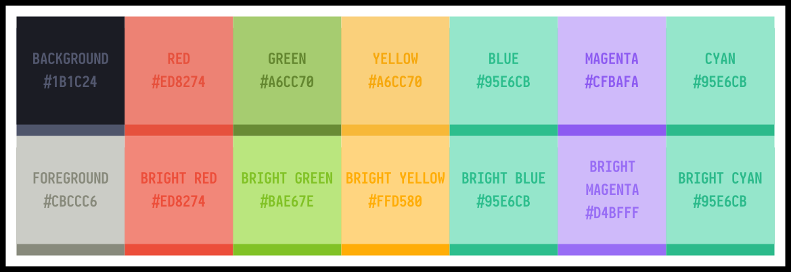

# Mayukai Terminal Themes

> Terminal themes based on [VS Code Mayukai Mirage Theme](https://github.com/GulajavaMinistudio/Mayukai-Theme)


## Preview




## Installation

### .Xresources
Copy all colours from `.Xresources` to your `.Xresources`. Make sure you comment out your previous colour.
After doing that, just run this command.

```bash
$ xrdb ~/.Xresources
```

or

```bash
$ xrdb -merge ~/.Xresources
```

Restart your terminal to take effect.


### Alacritty
Copy all colours from `alacritty.yml` to your `alacritty.yml`. Make sure you comment out your previous colour.
Restart your terminal to take effect.


### Kitty
Copy all colours from `kitty.conf` to your `kitty.conf`. Make sure you comment out your previous colour.
Restart your terminal to take effect.
